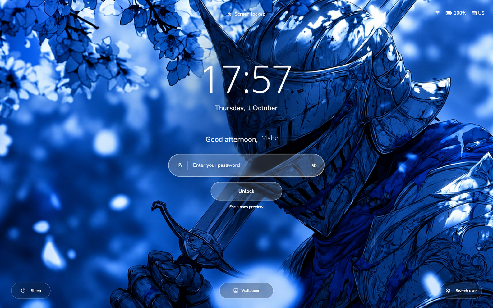
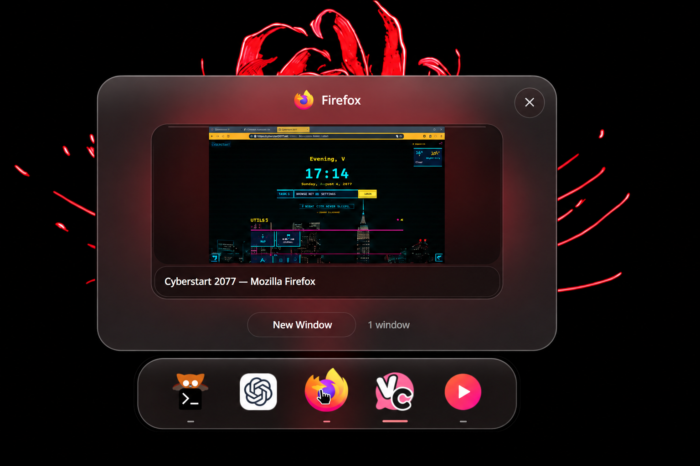
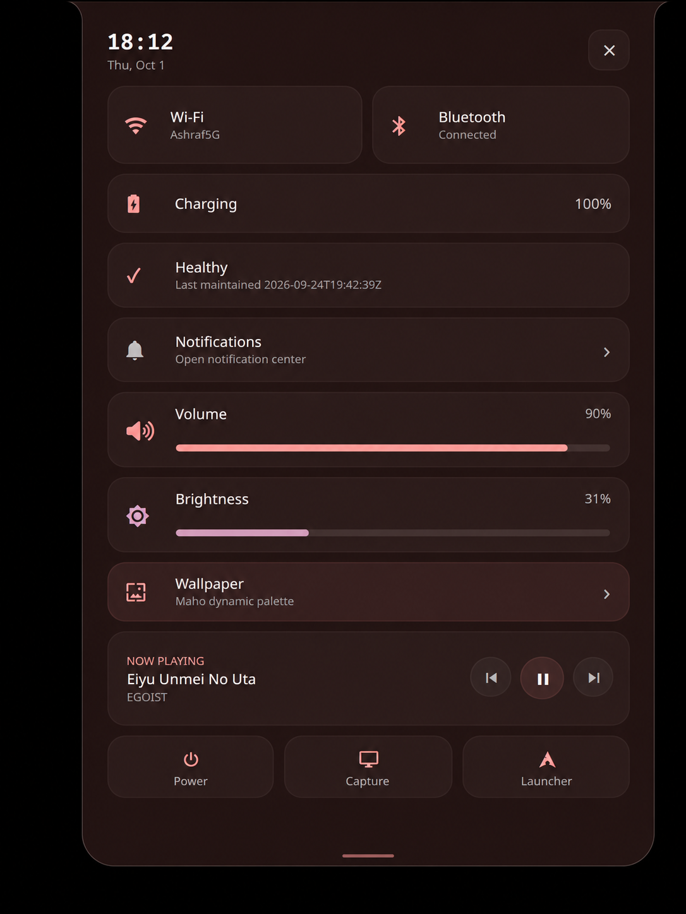
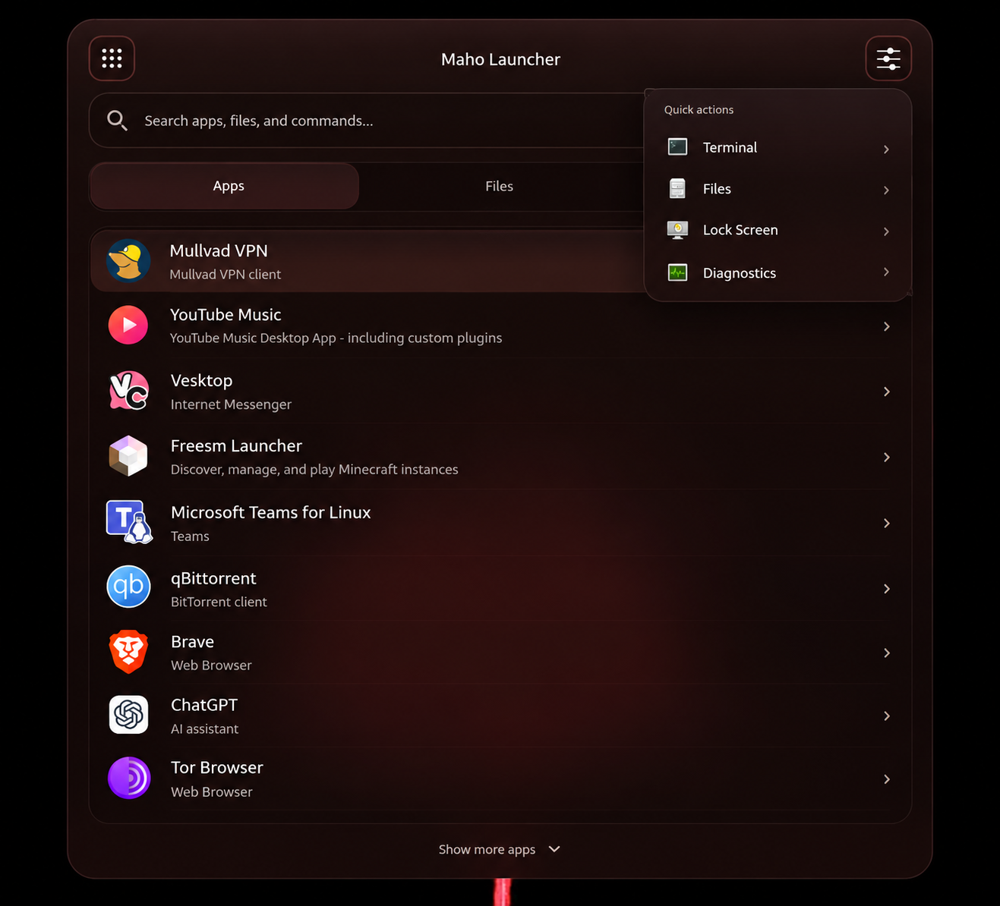
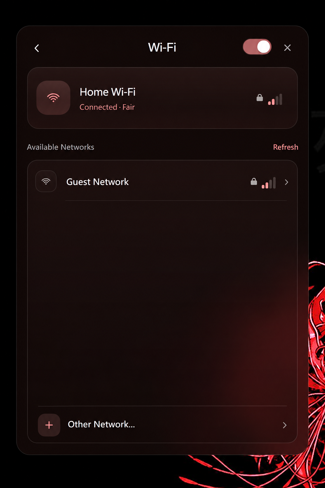
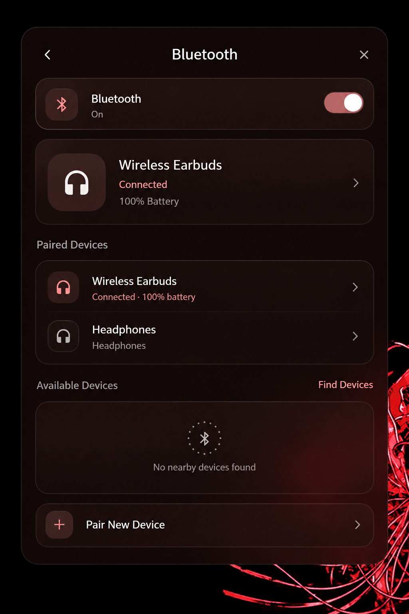
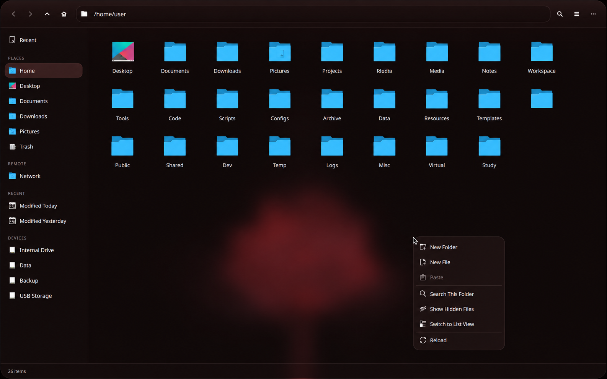
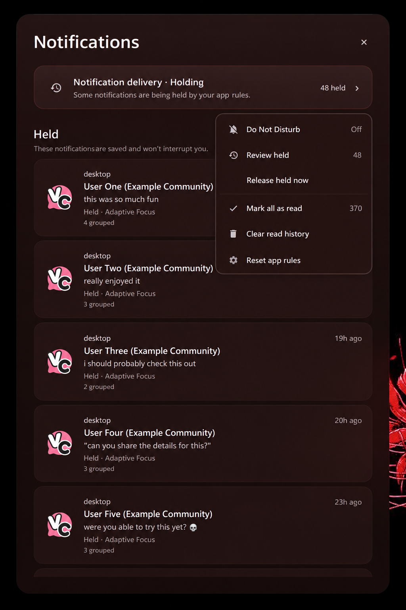
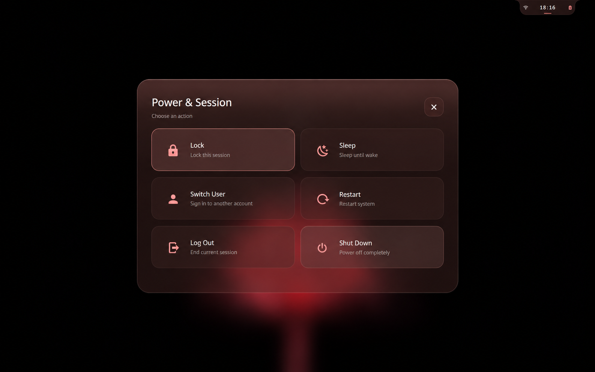
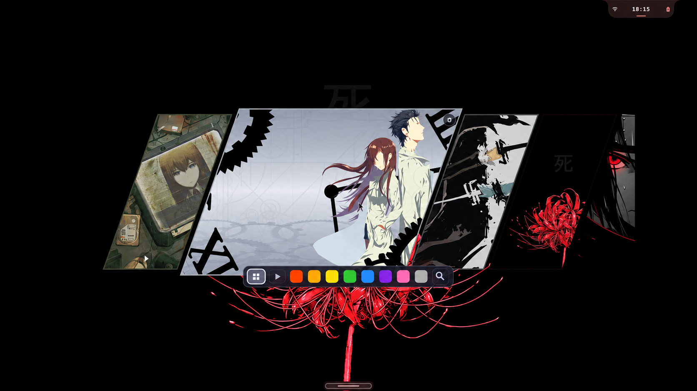

  

# MahoOS

**Linux built to recover.**

MahoOS is a Pre-V1 Arch-based operating system and desktop platform built around one rule: important changes should be **owned, reversible, and verified**.

> **Own the system. Trust the system. Stop babysitting the system.**

**Pre-V1:** active development. Interfaces and guarantees may still change before V1.

## Preview

<strong>Maho Lock / SDDM</strong>

 

  

<strong>Desktop &amp; Dock</strong> — window previews, dock, and desktop composition

 

  

<strong>Maho Edge</strong> — system controls, health, media, and entry points

 

  

<strong>Maho Launcher</strong> — apps, files, commands, and quick actions

 

  

<strong>Maho Link</strong> — Wi-Fi and Bluetooth connectivity

 

  <strong>Wi-Fi</strong>  
  

  <strong>Bluetooth</strong>  
  

NetworkManager owns networking state. BlueZ owns Bluetooth state.

<strong>Maho Files</strong> — native Qt/KIO file management

 

  

Places, devices, search, context actions, and filesystem operations.

<strong>Maho Notify</strong> — held delivery, Adaptive Focus, and notification history

 

  

<strong>Power &amp; Session</strong> — explicit session and power actions

 

  

<strong>Wallpaper Picker &amp; Dynamic Palette</strong> — wallpaper selection and palette adaptation

 

  

Wallpaper-driven palettes keep the shell visually coherent with the active desktop.

## Why MahoOS

- **Recover deliberately.** Risky system changes are tied to known-good recovery state and verified afterward.
- **Trust current evidence.** Missing or stale evidence never silently becomes healthy or trusted state.
- **Bound authority.** Privilege alone is not enough; mutation authority is explicit, scoped, and attributable.
- **Stay native.** MahoOS coordinates Linux authorities such as NetworkManager, BlueZ, KIO/Solid, PipeWire/WirePlumber, and XDG instead of replacing them with parallel state.

MahoOS is not a theme pack or an Arch rice. The desktop and reliability system are built as one product.

## Architecture in one minute

- **MahoShell** — the visible desktop, controls, and presentation.
- **MahoSystem** — Guardian truth, trust, updates, generations, recovery, and bounded system authority.
- **Linux authorities** — the existing subsystem owners that remain authoritative for networking, Bluetooth, files, audio, application identity, and related state.

MahoShell presents and requests. MahoSystem decides and coordinates.

Read the full model in [Architecture](docs/ARCHITECTURE.md) or use [Components](docs/COMPONENTS.md) to find where a change belongs.

<strong>Reliability contract</strong>

 

- unknown, stale, or missing evidence is not healthy evidence;
- operational health is not the same thing as trust;
- root privilege is not sufficient mutation authority;
- authority is exact, bounded, scoped, expiring, and attributable;
- Maho Update owns system-update mutation and automatic AUR installation is forbidden;
- reboot, shutdown, firmware mutation, and destructive user-disk actions are never hidden.

## Project status

MahoOS is **Pre-V1**, not a general-release claim. The repository already contains substantial desktop, Guardian, generation, update/recovery, prevention, installer, first-boot, and boot-trust work. Fresh-install convergence, broader certification, physical trust/provisioning gates, and release governance are still being completed.

See the [Roadmap](docs/ROADMAP.md). Historical certification remains under `docs/history/` and `docs/evidence/` as evidence, not current authority.

## Documentation

- [Architecture](docs/ARCHITECTURE.md) — canonical system model
- [Components](docs/COMPONENTS.md) — ownership and routing map
- [Development](docs/DEVELOPMENT.md) — build, test, package, diagnose
- [Contributing](CONTRIBUTING.md) — contribution rules
- [Roadmap](docs/ROADMAP.md) — Pre-V1 → V1 direction
- [Security](SECURITY.md) — disclosure and reporting policy
- [AGENTS.md](AGENTS.md) — machine and AI contributor contract

## License

Unless otherwise stated, original MahoOS code is licensed under **GPL-3.0-only**. Files and third-party material carrying their own license notices remain governed by those terms. See [LICENSE](LICENSE) and [Third-party notices](THIRD_PARTY_NOTICES.md).
